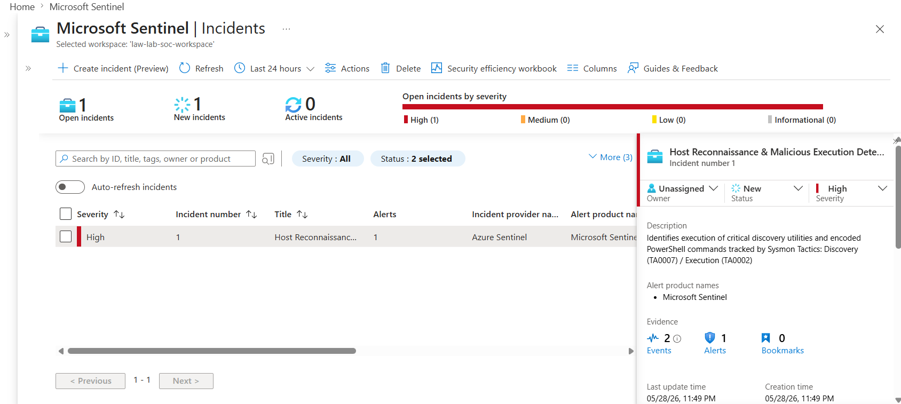

# Cloud-Native SIEM & EDR Implementation Lab
An end-to-end security engineering project demonstrating the implementation of a corporate logging infrastructure, defensive telemetry pipelines, attack simulation, and automated incident response within Microsoft Azure.

---

## 🛠️ Project Objective & Real-World Scope
This project showcases the skills required of a modern Cloud Security Engineer or SOC Analyst. Moving past purely theoretical security concepts, I built an enterprise-scale security architecture inside Azure, simulated real adversary techniques, and engineered detection mechanics to automate alert validation.

### Core Architecture Components:
* **Centralized SIEM Platform:** Microsoft Sentinel integrated with a dedicated Log Analytics Workspace to handle structured security event ingestion.
* **High-Fidelity Endpoint Auditing (EDR):** Customized **Sysmon (System Monitor)** deployment mapped with SwiftOnSecurity baseline configurations to capture deep kernel-level telemetry.
* **Adversary Simulation Node:** A dedicated Kali Linux deployment acting as an external threat actor targeting internal corporate assets.

---

## 🗺️ Lab Infrastructure & Network Topology

To stay strictly within the resource limitations and core quotas of a standard Azure Free Trial subscription, the lab's infrastructure was intelligently optimized into a hard-capped **4-vCPU footprint** without sacrificing defensive data visibility.

| Asset Name | Operating System | Subnet Placement | Internal IP | Role in Lab Matrix | vCPU Cost |
| :--- | :--- | :--- | :--- | :--- | :--- |
| **`vm-corp-srv`** | Windows Server 2022 | `snet-corp-endpoints` | `10.0.1.X` | Target Domain Controller / Host Telemetry Engine | 2 Cores (`Standard_B2s`) |
| **`vm-kali-attack`** | Kali Linux | `snet-attacker-zone` | `10.0.2.X` | External Adversary Emulation Platform | 2 Cores (`Standard_B2s`) |

### Perimeter Hardening (NSG Architecture)
To implement a zero-trust model before generating attacks, the Network Security Groups (NSGs) guarding both assets were restricted. Administrative entryways—specifically **RDP (Port 3389)** on the Windows target and **SSH (Port 22)** on the Kali node—were locked down exclusively to the analyst’s personal public WAN IP address, protecting the lab environment from internet-wide scanning arrays.

---

## 🛰️ Telemetry Pipelines & Real-World Bug Fixing

Telemetry collection was established using the modern **Azure Monitor Agent (AMA)** linked via cloud-native **Data Collection Rules (DCRs)**.

### The Ingestion Pipeline Breakdown:
1. **Windows Security Events:** Configured a DCR to ingest all raw audit policy configurations directly into the `SecurityEvent` schema table.
2. **Sysmon Telemetry:** Deployed the Sysmon agent locally on the target server using custom XML parsers to direct logs to `Microsoft-Windows-Sysmon/Operational`.

              +-----------------------+
              |  vm-corp-srv (Target) |
              |   [Security Logs]     |
              |   [Sysmon Kernel]     |
              +-----------+-----------+
                          | (Azure Monitor Agent)
                          v
            +-------------+-------------+
            | Data Collection Rules (DCR)|
            +-------------+-------------+
                          |
                          v
         +----------------+----------------+
         | Microsoft Sentinel Workspace    |
         |   - SecurityEvent Table         |
         |   - Event (Sysmon) Table        |
         +---------------------------------+

## Technical Problem-Solving: Overcoming XML Schema Mismatches
During Phase 4 (Hunting Process Creation via Sysmon Event ID 1), an initial KQL analytics string looking for named XML tags (`CommandLine">`) failed to yield results. 

Upon analyzing the raw payload schema, I discovered the local Azure Monitor Agent was packing individual command arguments into generic, unmapped `<Param>` XML data blocks. To bypass this schema limitation and build a resilient detection mechanism, I refactored the analytic logic to parse data dynamically using an unparsed `has_any` string validation model across the entire `EventData` array block.

---

    